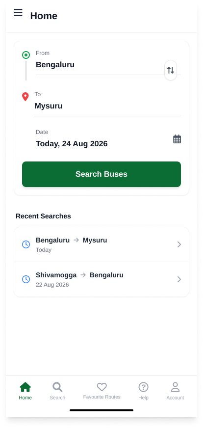
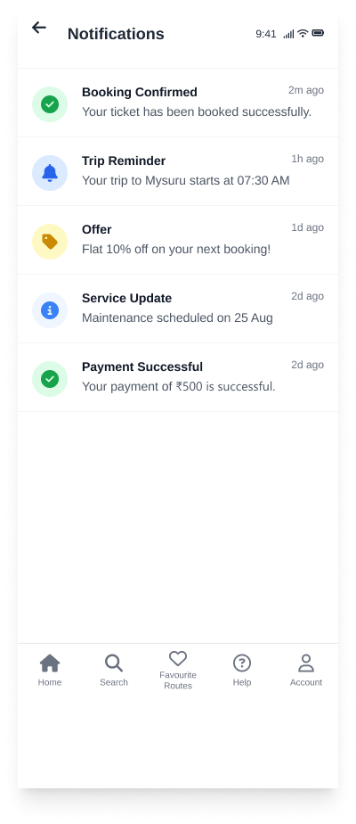

# 🚌 Bus Tracking - Smart Transit Android App

A modern, full-featured Android application built with **Jetpack Compose**, **Kotlin**, and **Google Maps** for real-time bus tracking, route exploration, and transit assistance.

---

## ✨ Features

- 📍 **Live Bus Tracking**: Real-time interactive map with live bus locations, estimated arrival times, speed, and stop markers.
- 🔍 **Route Search & Discovery**: Search by bus number, source, and destination with detailed intermediate stop information.
- 🚏 **Bus Details**: Comprehensive route breakdown, operating hours, ticket fares, and upcoming stop alerts.
- ⭐ **Favorites**: Save frequent bus lines and stops for fast 1-tap access.
- 🤖 **AI Assistant**: Intelligent transit assistant for route recommendations, travel queries, and voice queries.
- 🌐 **Multi-Language Support**: Complete localization support for **English** and **Kannada (ಕನ್ನಡ)**.
- 🔔 **Notifications**: Real-time transit updates, bus arrival alerts, and delay announcements.
- 👤 **User Profile & Customization**: Manage profile info, toggle dark/light theme, and customize preferences.

---

## 📱 App Screenshots

| Home | Live Tracking | Bus Details |
| :---: | :---: | :---: |
|  |  |  |

| Search Results | Favorites | AI & Support |
| :---: | :---: | :---: |
|  |  |  |

| Side Menu | Notifications | Profile |
| :---: | :---: | :---: |
|  |  |  |

---

## 🛠️ Tech Stack & Architecture

- **Language**: [Kotlin](https://kotlinlang.org/) (2.2.10)
- **UI Framework**: [Jetpack Compose](https://developer.android.com/jetpack/compose) with [Material 3](https://m3.material.io/)
- **Navigation**: Jetpack Navigation Compose
- **Maps**: [Google Maps Compose](https://github.com/googlemaps/android-maps-compose) & Google Play Services Maps
- **Image Loading**: [Coil Compose](https://coil-kt.github.io/coil/compose/)
- **Icons**: Extended Material Icons
- **Min SDK**: 24 (Android 7.0 Nougat)
- **Target SDK**: 37

---

## 🚀 Getting Started

### Prerequisites

- Android Studio Meerkat (or newer)
- Android SDK 37
- JDK 11 or higher
- Google Maps API key (optional for map tiles)

### Setup & Installation

1. **Clone the repository**:
   ```bash
   git clone https://github.com/SANJAIDHARMALINGAM/Bus-Trackinng-.git
   cd Bus-Trackinng-
   ```

2. **Open in Android Studio**:
   - Open Android Studio -> Select **Open an Existing Project** -> Navigate to the cloned folder.

3. **Google Maps Configuration (Optional)**:
   - Add your Google Maps API key in `app/src/main/res/values/strings.xml`:
     ```xml
     <string name="google_maps_key">YOUR_API_KEY_HERE</string>
     ```

4. **Build and Run**:
   - Connect an Android device or launch an emulator.
   - Click **Run (Shift + F10)** or build via CLI:
     ```bash
     ./gradlew assembleDebug
     ```

---

## 📄 License

This project is open source and available under the [MIT License](LICENSE).
